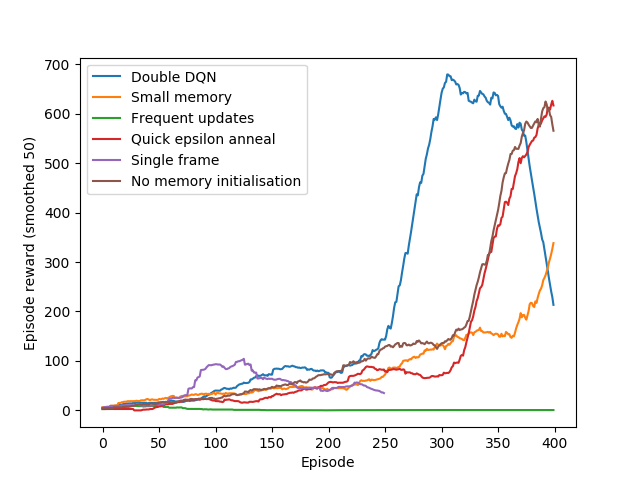
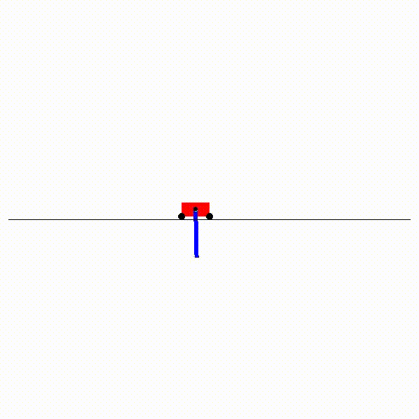

# DQN

This is a basic implementation of Deep Q Learning. We have implemented linear and convolutional DQN and DDQN models, with 
DQN and double DQN algorithms

Next steps:
* Model trained on Atari games
* Prioritized Experience Replay

## To run
To begin, setup [OpenAI gym](https://gym.openai.com/) and install the packages in `requirements.txt`.

We have an example script which trains a model on the CartPoleSwingUp environment (this requires gym <= 0.9.4).
Run `python -m examples.cartpoleswingup_linear` in the top-level directory.

(To run Box2D environments, I used [this Docker container](https://github.com/TTitcombe/docker_openai_gym) - 
check it out if you are also having problems installing Gym)

## Results
The best models trained on each env are present in `results/models/`. There you will find the saved pytorch model as a `.pth` file and
a graph comparing the reward per episode against random play.

**Linear models**

| Model | Env             |      Score      |
|-------|-----------------|:---------------:|
| DQN | CartPole-v1     |  500            |
| DQN | CartPoleSwingUp\* |  872 +/- 3          |

You can see how dependant the linear model is on various hyperparameters in the following graph

\**Note: While we can train high-performing models on CartPoleSwingUp, these are very unstable, even when training for millions of frames and with a large (100000) capacity memory. 
It is not clear why this is the case.*

**Conv model**

| Model | Env | Score |
|-------|-----|:-----:|

